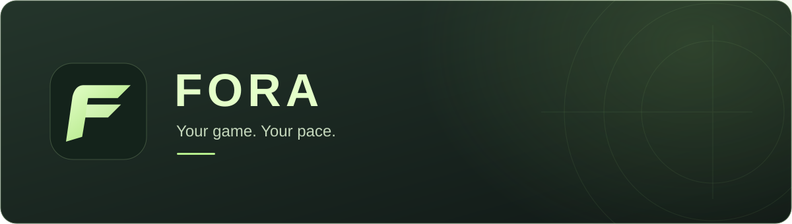
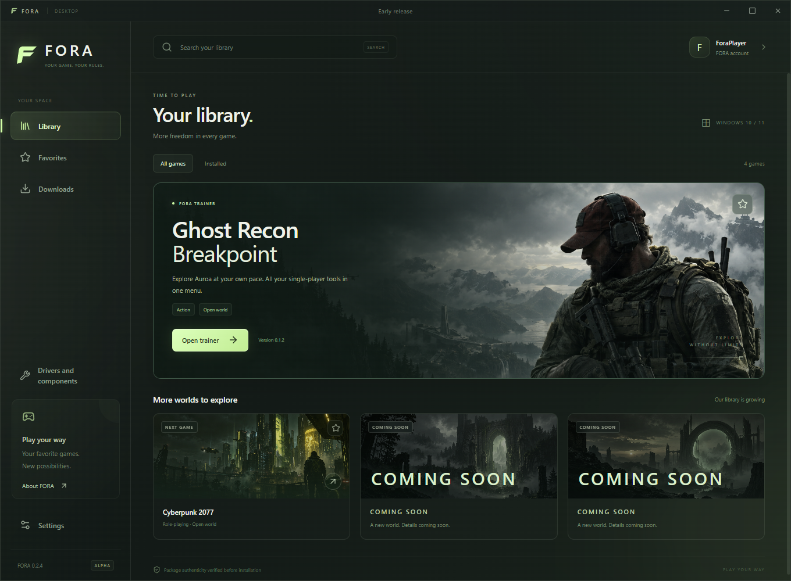
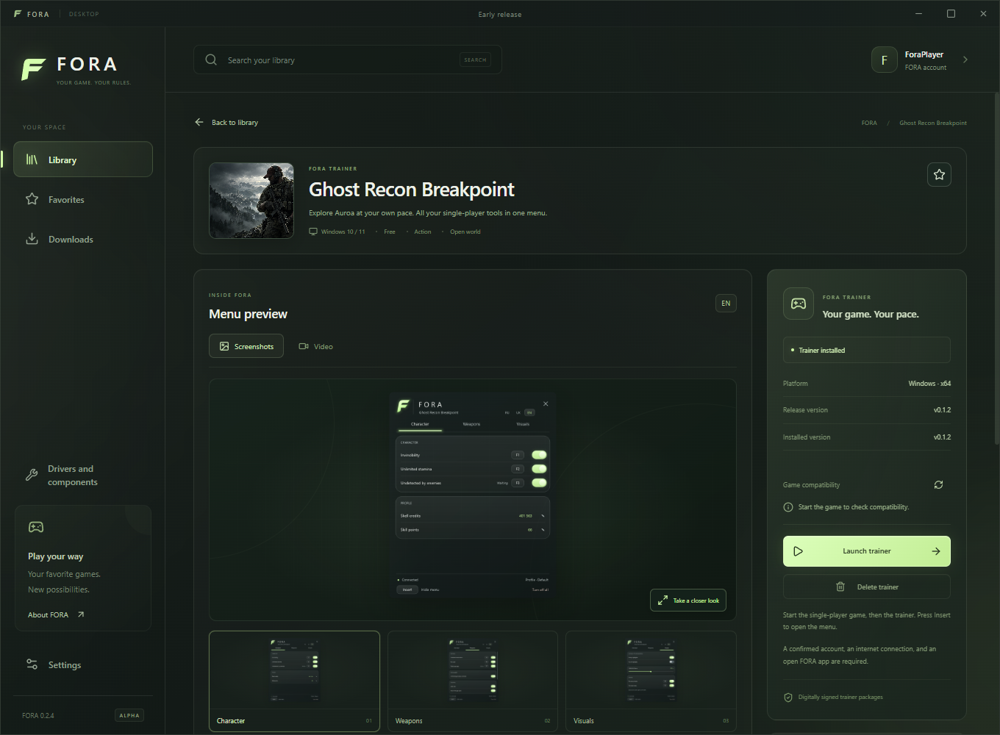
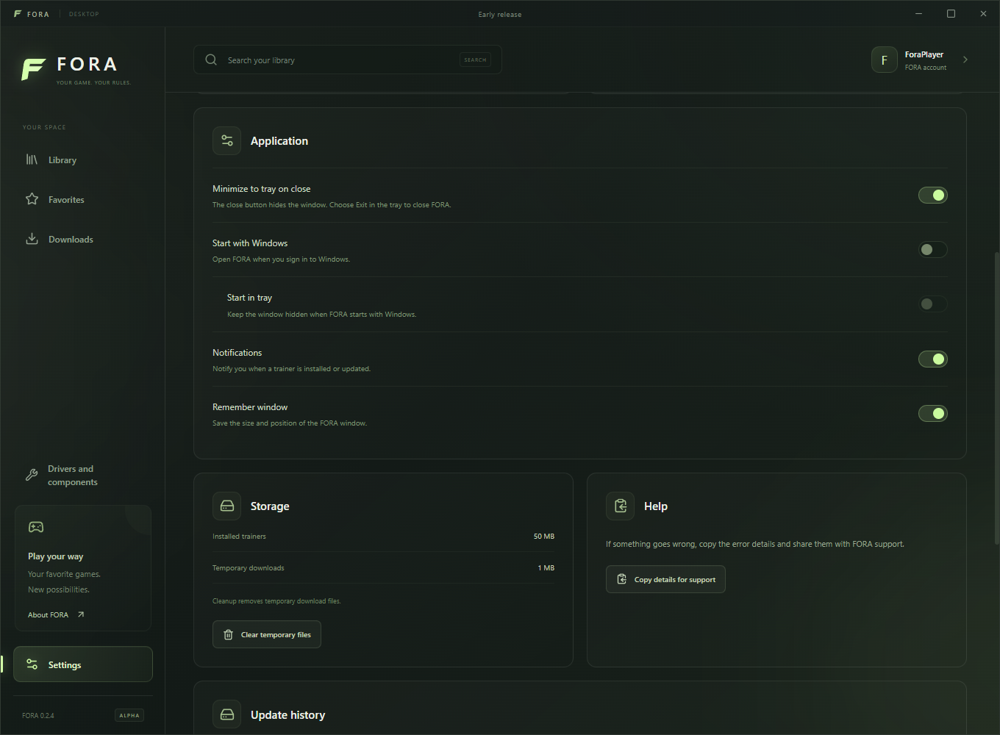
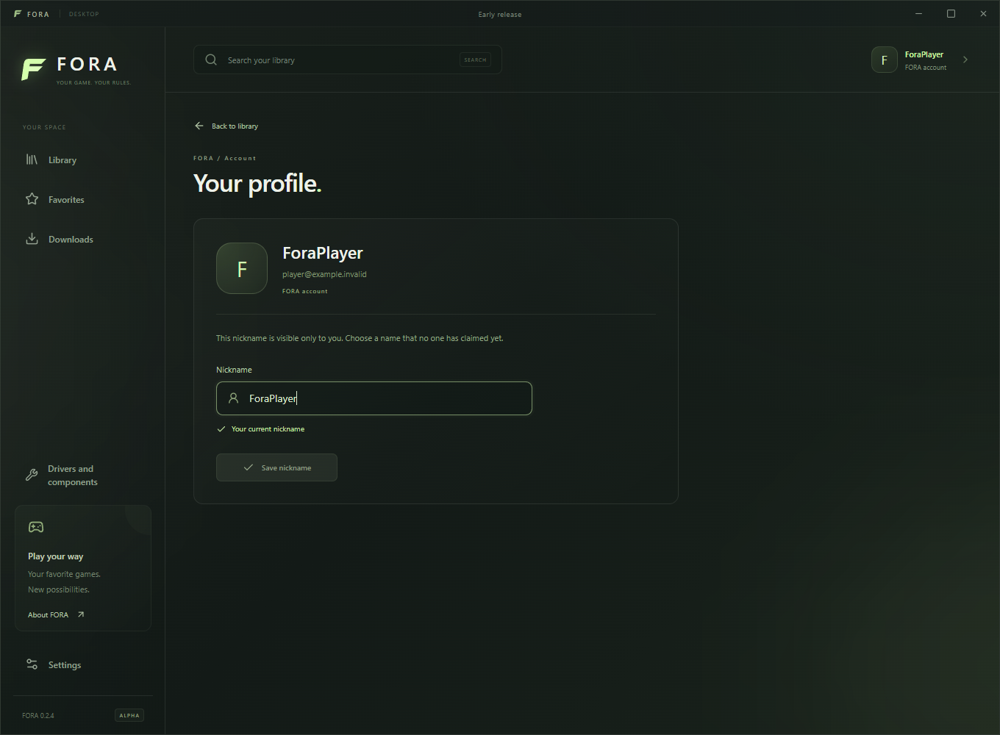
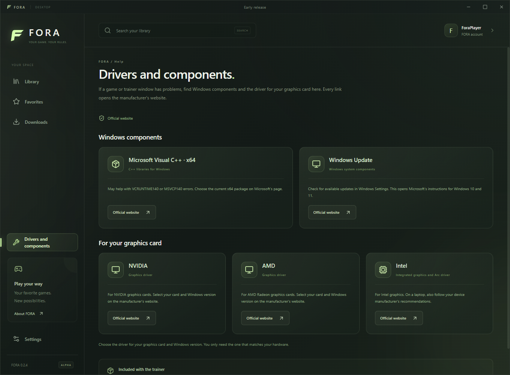

  

  Game trainers in one Windows app.

  
  

FORA brings your trainer library, downloads, and settings into one place. Find a game, install its available trainer, and launch it when you are ready to play. Trainers download separately, so you only keep the ones you use.

Screenshots show FORA 0.2.4 in English using a demo profile. Game and trainer availability may differ.

### Get started

1. Open the [latest release](https://github.com/eweew1/fora-releases/releases/latest) and download the `FORA-Setup-*.exe` installer.
2. Install FORA and sign in to your account.
3. Choose a game and install a trainer available to your account.
4. Start the game, then launch its trainer from FORA.

You only need the `.exe` installer to install FORA. The other release files are used by the app's updater.

**Requirements:** Windows 10 or 11 (64-bit), a FORA account, and an internet connection. Keep FORA open and stay signed in while using a trainer. The catalog shows which games and trainers are currently available; more games will be added over time.

### Your library

Browse the catalog, save favorites, or filter it down to your installed trainers. Each game has its own page with a description and available trainer features, so you can see what it offers before downloading.

### Install what you need

The trainer panel shows download progress, release and installed versions, and compatibility information when available. Install, launch, update, or remove a trainer from the same place. Removing a trainer clears its downloaded files from your PC; you can install it again later.

### Make FORA fit your desktop

Choose whether closing the window keeps FORA in the system tray or quits it. You can also enable Windows startup, start in the tray, adjust notifications, and remember the window position. Settings show local storage use and provide a way to clear temporary files.

### Choose your nickname

Open your account panel to set an optional nickname. Names are unique across FORA accounts, including names with different letter cases. Your nickname is currently a personal display name inside FORA.

### Help with components and drivers

If a trainer has trouble starting, check **Drivers & components**. It explains the relevant components and links to official Microsoft, NVIDIA, AMD, and Intel pages, with guidance on when an update might help.

### Updates and support

FORA checks for app updates automatically and asks you to restart once an update is ready. Trainer updates are managed separately from app updates. The download button above always opens the latest release.

If something goes wrong, [report an issue](https://github.com/eweew1/fora-releases/issues/new) with your FORA version, game name, and the steps that led to the problem. You can copy support information from Settings to help describe the issue.
